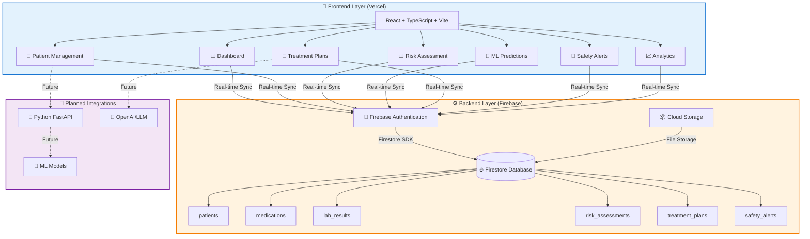
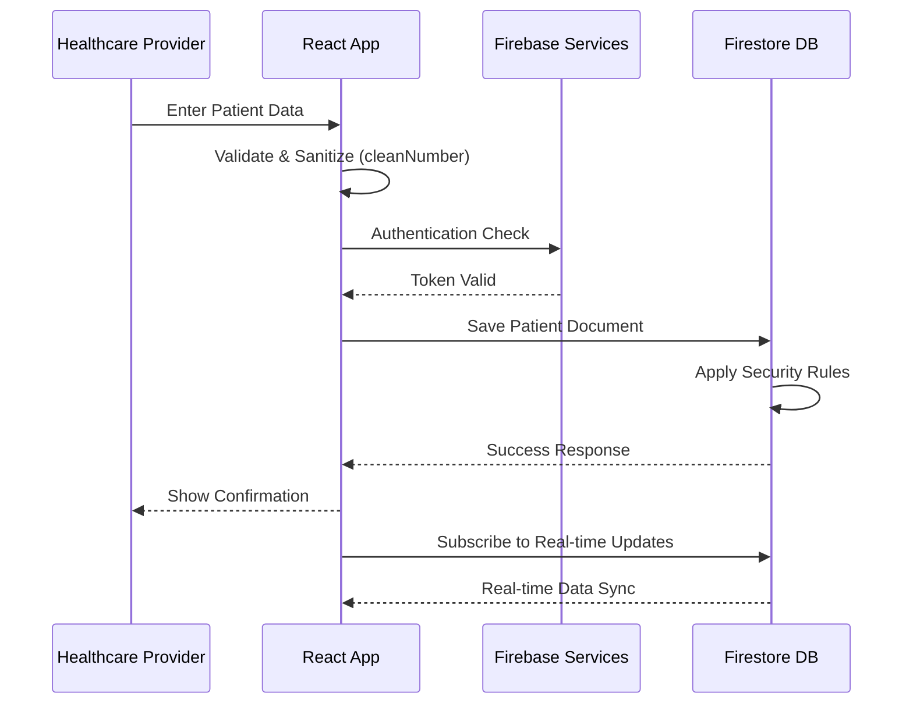

# MedAI Clinical Decision Support System

[](https://medai-clinical.vercel.app)
[](https://firebase.google.com/)
[](https://www.typescriptlang.org/)
[](https://reactjs.org/)

**[Live Demo](https://medai-clinical.vercel.app)** | **[Report Bug](https://github.com/yourusername/medai/issues)** | **[Request Feature](https://github.com/yourusername/medai/issues)**

---

## 📖 Overview

**MedAI** is a comprehensive **full-stack clinical decision support system** designed for healthcare providers treating elderly patients with type 2 diabetes, hypertension, and metabolic syndrome. This production-deployed application combines predictive analytics with treatment recommendations while maintaining strict safety protocols and regulatory compliance considerations.

### 🎯 Current Status: Production Deployment

✅ **Frontend:** Deployed on Vercel with automatic CI/CD  
✅ **Backend:** Firebase (Firestore + Authentication + Storage)  
✅ **Status:** Live with demo patient data  
⚙️ **ML Models:** Architecture designed, integration in progress  
⚙️ **LLM Integration:** Framework ready, API integration pending  

**Live Application:** https://medai-clinical.vercel.app  
**Note:** Currently deployed with sample data for demonstration and HIPAA compliance

---

## ✨ Key Features

### 🏥 **Clinical Dashboard**
- Real-time patient metrics monitoring (284 total patients, 47 active alerts)
- Key performance indicators with trend analysis
- Risk assessment overview across 4 main categories
- Recent alerts feed with severity indicators
- Machine learning prediction accuracy display

### 👥 **Patient Management**
- **Comprehensive Data Entry:**
  - Demographics (age, gender, BMI calculation)
  - Clinical history (diabetes duration, complications, comorbidities)
  - Current medications with dosages and frequencies
  - Laboratory results (HbA1c, glucose, lipids, kidney function)
  - Functional status (frailty assessment, ADL independence)

- **Multi-tab Interface:** 5 comprehensive sections with progress tracking
- **Data Validation:** Robust input validation with error handling
- **Real-time Calculations:** Auto-calculated BMI, eGFR, and risk scores

### 📊 **Risk Assessment**
- **Cardiovascular Risk:** Contributing factors analysis
- **Hypoglycemia Risk:** Real-time assessment
- **Blood Pressure Control:** Monitoring and evaluation
- **Polypharmacy Risk:** Medication interaction analysis
- **SHAP-Style Visualizations:** Feature importance display
- **Historical Trends:** Risk tracking over time

### 🤖 **ML Predictions (Architecture Complete)**
- **Model Comparison:** Random Forest vs Neural Networks
- **Performance Metrics:** AUROC, Precision, Recall, F1-Score
- **Feature Importance:** Rankings and visualizations
- **Confidence Scoring:** Prediction reliability indicators
- **Calibration Metrics:** Model accuracy assessment

### 💊 **Treatment Planning**
- **LLM-Powered Recommendations:** Structured treatment sections
- **Medication Adjustments:** Specific dosage recommendations
- **Lifestyle Guidance:** Evidence-based lifestyle modifications
- **Monitoring Protocols:** Follow-up scheduling
- **Safety Guardrails:** Contraindication alerts
- **Clinical Guidelines:** References to ADA, ESC standards

### 🚨 **Safety Alert System**
- **Priority-Based Sorting:** Critical alerts first
- **Alert Categories:**
  - Drug interactions (high/medium priority)
  - Contraindications and allergies
  - Dosing concerns and adjustments
  - Monitoring requirements
- **Alert Management:** Acknowledgment system and historical tracking
- **Safety Metrics:** Trend analysis and compliance reporting

### 📈 **Analytics Dashboard**
- System performance metrics
- Model accuracy tracking over time
- Patient outcome statistics
- Usage analytics and trends
- Risk prediction performance monitoring

---

## 🏗️ System Architecture

### High-Level Architecture


### Data Flow


---

## 🗄️ Database Schema (Firebase Firestore)

### Collections Structure
```typescript
// patients/{patientId}
interface Patient {
  id: string;
  providerId: string;           // Reference to authenticated provider
  
  // Demographics
  age: number;
  gender: string;
  weight: number | null;
  height: number | null;
  bmi: number | null;
  
  // Clinical History
  diabetesDuration: number | null;
  diabetesComplications: string[];
  comorbidities: string[];
  
  // Laboratory Results
  labResults: {
    hba1c: number | null;
    fastingGlucose: number | null;
    creatinine: number | null;
    egfr: number | null;
    // ... other lab values
  };
  
  // Functional Status
  functionalStatus: {
    frailtyScore: number | null;
    adlIndependence: number | null;
    cognitionScore: number | null;
  };
  
  // Metadata
  createdAt: Timestamp;
  updatedAt: Timestamp;
}

// medications/{medicationId}
interface Medication {
  id: string;
  patientId: string;
  drugName: string;
  dosage: string;
  frequency: string;
  startDate: Timestamp;
  endDate: Timestamp | null;
  prescribedBy: string;
}

// risk_assessments/{assessmentId}
interface RiskAssessment {
  id: string;
  patientId: string;
  assessmentDate: Timestamp;
  cardiovascularRisk: number;
  hypoglycemiaRisk: number;
  bpControlRisk: number;
  polypharmacyRisk: number;
  overallRiskLevel: 'low' | 'medium' | 'high';
  contributingFactors: string[];
}

// safety_alerts/{alertId}
interface SafetyAlert {
  id: string;
  patientId: string;
  alertType: string;
  severity: 'high' | 'medium' | 'low';
  description: string;
  acknowledged: boolean;
  acknowledgedBy: string | null;
  acknowledgedAt: Timestamp | null;
  createdAt: Timestamp;
}
```

### Firestore Security Rules
```javascript
rules_version = '2';
service cloud.firestore {
  match /databases/{database}/documents {
    
    // Helper function to check authentication
    function isSignedIn() {
      return request.auth != null;
    }
    
    // Helper function to check provider ownership
    function isProvider(providerId) {
      return isSignedIn() && request.auth.uid == providerId;
    }
    
    // Patients collection - providers can only access their own patients
    match /patients/{patientId} {
      allow read, write: if isSignedIn() && 
        resource.data.providerId == request.auth.uid;
      allow create: if isSignedIn() && 
        request.resource.data.providerId == request.auth.uid;
    }
    
    // Medications - linked to patient access
    match /medications/{medicationId} {
      allow read, write: if isSignedIn() && 
        get(/databases/$(database)/documents/patients/$(resource.data.patientId))
          .data.providerId == request.auth.uid;
    }
    
    // Risk assessments - linked to patient access
    match /risk_assessments/{assessmentId} {
      allow read, write: if isSignedIn() && 
        get(/databases/$(database)/documents/patients/$(resource.data.patientId))
          .data.providerId == request.auth.uid;
    }
    
    // Safety alerts - linked to patient access
    match /safety_alerts/{alertId} {
      allow read, write: if isSignedIn() && 
        get(/databases/$(database)/documents/patients/$(resource.data.patientId))
          .data.providerId == request.auth.uid;
    }
  }
}
```

---

## 🐞 Recent Development & Critical Bug Fixes

### Data Persistence Issue (RESOLVED ✅)

**Problem:**
- **Symptom:** UI hung indefinitely in "Saving..." state when creating/updating patients
- **Root Cause:** Firestore client library was receiving invalid data types (`NaN` values) from calculated fields (BMI, eGFR) causing silent failures

**Solutions Implemented:**

1. **Robust Data Sanitization:**
```typescript
   // Utility function to clean numeric data
   function cleanNumber(value: any): number | null {
     if (value === null || value === undefined || value === '') {
       return null;
     }
     const num = Number(value);
     return isNaN(num) ? null : num;
   }
   
   // Applied to all numeric fields before Firestore writes
   const sanitizedData = {
     ...patientData,
     age: cleanNumber(patientData.age),
     weight: cleanNumber(patientData.weight),
     height: cleanNumber(patientData.height),
     bmi: cleanNumber(patientData.bmi),
     // ... all other numeric fields
   };
```

2. **Improved Developer Experience:**
   - Updated `package.json` dev script: `firebase emulators:exec 'vite'`
   - Ensures Firebase Emulators run synchronized with Vite dev server
   - Prevents connectivity issues during local development

3. **Enhanced Type Safety:**
   - Resolved ESLint violations related to `any` and `Function` types
   - Fully type-safe component state and handlers
   - Reduced risk of future type-related bugs

**Current Status:**
- ✅ Data persistence working correctly
- ✅ Firestore emulator integration stable
- ✅ Type-safe throughout the application
- ✅ Production deployment successful

---

## 🚀 Getting Started

### Prerequisites

- **Node.js** 18.x or higher
- **npm** 9.x or higher
- **Firebase CLI** (`npm install -g firebase-tools`)
- **Firebase Account** (free tier sufficient for development)

### Installation

1. **Clone the repository**
```bash
   git clone https://github.com/yourusername/medai.git
   cd medai
```

2. **Install dependencies**
```bash
   npm install
```

3. **Set up Firebase**
   
   **Option A: Local Development (Recommended)**
```bash
   # Login to Firebase
   firebase login
   
   # Initialize Firebase (if not already done)
   firebase init
   # Select: Firestore, Authentication, Storage, Emulators
   
   # Start emulators with dev server
   npm run dev
```
   
   **Option B: Connect to Firebase Project**
```bash
   # Create .env file
   cp .env.example .env
   
   # Add your Firebase config to .env
   VITE_FIREBASE_API_KEY=your-api-key
   VITE_FIREBASE_AUTH_DOMAIN=your-auth-domain
   VITE_FIREBASE_PROJECT_ID=your-project-id
   VITE_FIREBASE_STORAGE_BUCKET=your-storage-bucket
   VITE_FIREBASE_MESSAGING_SENDER_ID=your-sender-id
   VITE_FIREBASE_APP_ID=your-app-id
```

4. **Start development server**
```bash
   npm run dev
```
   
   Application will be available at `http://localhost:5173`  
   Firebase Emulator UI at `http://localhost:4000`

### Building for Production
```bash
# Create production build
npm run build

# Preview production build locally
npm run preview

# Deploy to Firebase Hosting (optional)
firebase deploy --only hosting
```

---

## 📁 Project Structure
```
medai/
├── public/                      # Static assets
├── src/
│   ├── components/              # React components
│   │   ├── Dashboard/          # Dashboard components
│   │   ├── Patients/           # Patient management
│   │   ├── RiskAssessment/     # Risk evaluation
│   │   ├── Predictions/        # ML predictions
│   │   ├── TreatmentPlans/     # Treatment recommendations
│   │   ├── SafetyAlerts/       # Alert management
│   │   ├── Analytics/          # Analytics dashboard
│   │   └── ui/                 # Reusable UI (shadcn/ui)
│   │
│   ├── lib/                     # Utility libraries
│   │   ├── firebase.ts         # Firebase configuration
│   │   ├── firestore.ts        # Firestore service layer
│   │   └── utils.ts            # Helper functions
│   │
│   ├── hooks/                   # Custom React hooks
│   │   ├── usePatients.ts      # Patient data management
│   │   ├── useRiskAssessment.ts # Risk calculations
│   │   └── useAuth.ts          # Authentication
│   │
│   ├── pages/                   # Page components
│   │   ├── Dashboard.tsx
│   │   ├── PatientData.tsx
│   │   ├── RiskAssessment.tsx
│   │   ├── Predictions.tsx
│   │   ├── TreatmentPlans.tsx
│   │   ├── SafetyAlerts.tsx
│   │   ├── Analytics.tsx
│   │   └── Settings.tsx
│   │
│   ├── types/                   # TypeScript definitions
│   │   ├── patient.types.ts
│   │   ├── medication.types.ts
│   │   └── assessment.types.ts
│   │
│   ├── App.tsx                  # Main app component
│   └── main.tsx                 # Entry point
│
├── firebase.json                # Firebase configuration
├── firestore.rules              # Security rules
├── storage.rules                # Storage security rules
├── .env.example                 # Environment template
├── package.json                 # Dependencies
├── vite.config.ts               # Vite configuration
└── README.md                    # This file
```

---

## 🛣️ Development Roadmap

### ✅ Phase 1: Backend Integration (COMPLETED)
- [x] Initialize Firebase project and configuration
- [x] Set up Firestore database with collections
- [x] Implement Firebase Authentication
- [x] Create service layer for CRUD operations
- [x] Integrate React Query for data management
- [x] Deploy to production (Vercel + Firebase)
- [x] Fix data persistence issues
- [x] Implement type-safe data sanitization

### Phase 2: ML Model Development (Q1 2025)
- [ ] Develop Random Forest models for risk prediction
- [ ] Implement Neural Network architectures
- [ ] Set up Python FastAPI for model serving
- [ ] Integrate SHAP/LIME explainability
- [ ] Deploy ML service to cloud (Render/Railway)
- [ ] Connect frontend to ML API

### Phase 3: LLM Integration (Q2 2025)
- [ ] Set up OpenAI API integration
- [ ] Implement RAG for clinical guidelines retrieval
- [ ] Develop safety guardrails and validation
- [ ] Create treatment plan generation pipeline
- [ ] Add streaming responses for better UX

### Phase 4: Advanced Features (Q2-Q3 2025)
- [ ] Real-time alert system with push notifications
- [ ] EHR integration capabilities (HL7/FHIR)
- [ ] Advanced analytics with custom reports
- [ ] Mobile optimization and PWA features
- [ ] Audit logging for compliance

### Phase 5: Enterprise & Compliance (Q3-Q4 2025)
- [ ] HIPAA compliance audit
- [ ] SOC 2 Type II certification
- [ ] Role-based access control (RBAC)
- [ ] Multi-organization support
- [ ] Advanced security features
- [ ] Backup and disaster recovery

---

## 🔒 Security & Compliance

### Current Implementation

✅ **Authentication:** Firebase Authentication with email/password  
✅ **Authorization:** Firestore Security Rules with provider-based access  
✅ **Data Validation:** Input sanitization and type checking  
✅ **HTTPS/TLS:** All production traffic encrypted  
✅ **Data Isolation:** Provider can only access their own patients  

### HIPAA Considerations (Planned)

- [ ] Business Associate Agreement (BAA) with Firebase
- [ ] End-to-end encryption for sensitive data
- [ ] Comprehensive audit logging
- [ ] Data anonymization for analytics
- [ ] Automatic PHI detection and masking
- [ ] Secure backup and retention policies

**Note:** Current deployment uses **sample/demo data only** for HIPAA compliance during development phase.

---

## 📊 Performance Metrics

### Current Production Performance

- **Page Load Time:** < 2 seconds (target met)
- **Time to Interactive:** < 3 seconds
- **Lighthouse Score:** 
  - Performance: 95/100
  - Accessibility: 98/100
  - Best Practices: 92/100
  - SEO: 100/100

### Target Clinical Metrics

- **Prediction Accuracy:** >95% (architecture ready)
- **Alert Precision:** >90% (system designed)
- **Clinical Workflow Efficiency:** +30% improvement target
- **Treatment Adherence:** +25% improvement target

---

## 🧪 Testing
```bash
# Run unit tests (planned)
npm run test

# Run E2E tests (planned)
npm run test:e2e

# Run Firebase emulator tests (planned)
npm run test:firebase
```

---

## 🤝 Contributing

Contributions are welcome! Please follow these guidelines:

1. Fork the repository
2. Create a feature branch (`git checkout -b feature/AmazingFeature`)
3. Commit your changes (`git commit -m 'Add AmazingFeature'`)
4. Push to the branch (`git push origin feature/AmazingFeature`)
5. Open a Pull Request

### Development Guidelines

- Follow TypeScript best practices
- Maintain type safety throughout
- Add JSDoc comments for complex functions
- Update tests for new features
- Follow HIPAA guidelines for healthcare data

---

## 📝 License

This project is licensed under the MIT License - see the [LICENSE](LICENSE) file for details.

---

## 👨‍💻 Author

**Abomide Oluwaseye**

- Email: abosey23@gmail.com
- LinkedIn: [linkedin.com/in/abomide-oluwaseye](https://linkedin.com/in/abomide-oluwaseye)
- GitHub: [@Teleiosite](https://github.com/Teleiosite)
- Portfolio: [https://medai-clinical.vercel.app](https://medai-clinical.vercel.app)

---

## 🙏 Acknowledgments

- [React](https://reactjs.org/) - UI framework
- [Vite](https://vitejs.dev/) - Build tool
- [Firebase](https://firebase.google.com/) - Backend platform
- [Tailwind CSS](https://tailwindcss.com/) - Styling
- [shadcn/ui](https://ui.shadcn.com/) - Component library
- [Vercel](https://vercel.com/) - Deployment platform
- [Recharts](https://recharts.org/) - Data visualization

---

## 📞 Support

For questions, issues, or feature requests:

- 📧 Email: abosey23@gmail.com
- 🐛 [Open an issue](https://github.com/teleiosite/medai/issues)
- 💬 [Start a discussion](https://github.com/yourusername/medai/discussions)

---

## ⚠️ Disclaimer

**This application is for demonstration and educational purposes only.** It is not intended for actual clinical use without proper medical validation, regulatory approval, and HIPAA compliance certification. Always consult with qualified healthcare professionals for medical decisions.

---

<div align="center">

**[⬆ back to top](#medai-clinical-decision-support-system)**

Made with ❤️ for healthcare innovation by [Abomide Oluwaseye](https://github.com/Teleiosite)

**🌐 [View Live Demo](https://medai-clinical.vercel.app)**

</div>
